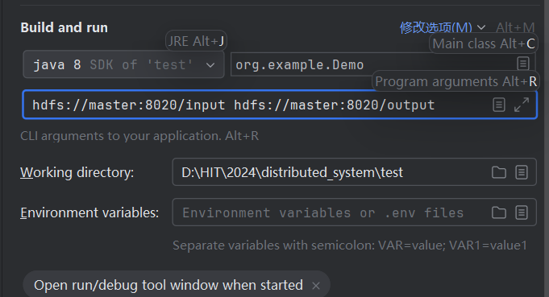
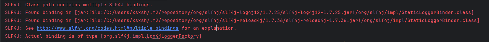
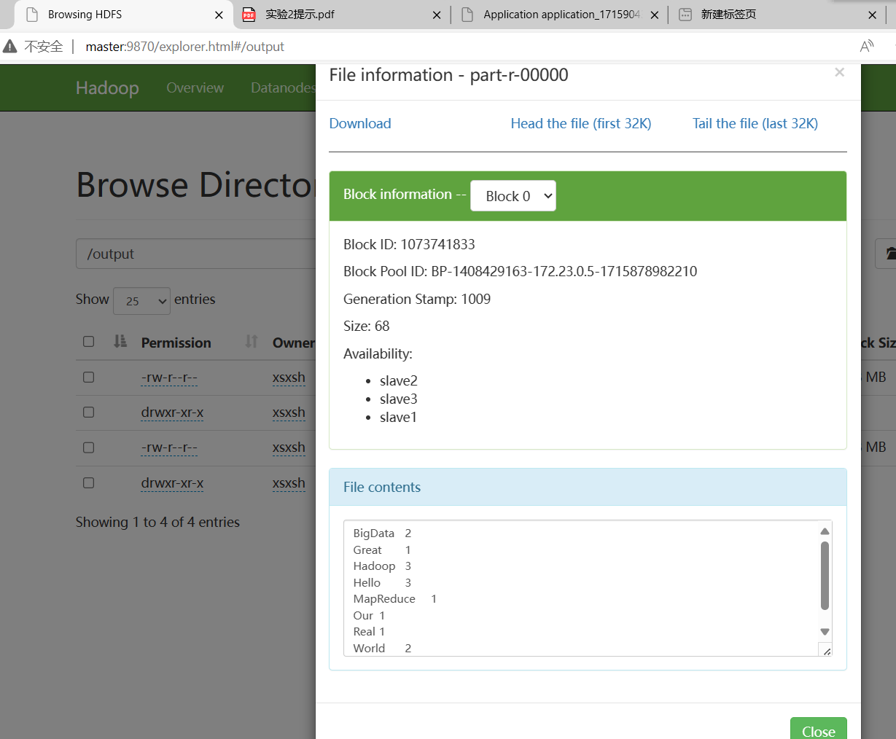

# 单机真分布式纯 Hadoop Docker 较速配置方式指北（用于实验）

本方案提供哈工大分布式系统 lab2 Hadoop Linux 环境配置方案，在已有 Docker 的前提下，可以实现七分钟以内完成 Hadoop 3.3.6 配置（指 Linux 部分）进行实验，以下给出详细操作步骤。

## 前置准备

本方案建立在已有 WSL 2 的前提下，新版本的 Docker 已经可以内嵌入 WSL 2 下已有的 Linux 系统，使用起来十分方便。

若只安装 Docker，不使用 WSL 2，本方案理论可行，但未经测试。

Docker 的下载与安装参见，https://docs.docker.com/desktop/install/windows-install/, 个人推荐使用 WSL 2 的方式。

## 具体步骤

1. git clone 本仓库到本地 `git clone https://github.com/Moujuruo/Docker-Hadoop-Cluster.git`
2. 进入仓库目录 `cd Docker-Hadoop-Cluster`
3. 进入 amd64 目录 `cd amd64`
4. 构建镜像 `docker build . -t hadoop`，这一步需要等待一些时间，网络正常情况下不超过 10 分钟
5. 返回上级目录 `cd ..`
6. 创建桥接网络 `docker network create hadoop-network`
6. 运行容器 `docker-compose up -d`

到这里如果一切正常，你应该能看到


此时，容器已经正常启动，你的环境已经搭建完成。环境由一个主机节点 master 和三个从机节点 slave1, slave2, slave3 组成。正常情况下都只要进入主机完成操作即可，命令为`docker exec -it master bash`。

Hadoop 暴露的几个端口如下：
- "8020:8020" # fs.defaultFS
- "9870:9870" # NameNode Web UI
- "9868:9868" # Secondary NameNode Web UI
- "8088:8088" # Yarn Web UI

为了在主机能够正常访问，还需要在主机的`C:\Windows\System32\drivers\etc`目录下的`hosts`文件中添加如下内容
```
127.0.0.1 master
127.0.0.1 slave1
127.0.0.1 slave2
127.0.0.1 slave3
```

> 注意，由于 Docker 的限制，这里将三台slave有关DataNode的端口映射到了主机的不同端口，具体可在`docker-compose.yml`中查看。

在这之后，除了 8020 外，其它都可以在本地浏览器中通过 `master:端口号` 或 `slave1/2/3:端口号` 访问。

此外再介绍几个操作方便使用 Docker，由于未知原因，这里不推荐使用 Docker Desktop 的可视化界面进行操作
- 容器关闭，`docker-compose stop`
- 容器再次启动，`docker-compose up -d`
- 进入容器使用 bash，`docker exec -it master bash`

## IDEA 连接

在 IDEA 中可以连接 Hadoop 集群，可以直接操作 HDFS，但需要完成关于 Windows 下 Hadoop 的环境配置。

该环境配置有两种方式，一种只要配置 winutils，一种则是完整配置 Hadoop 环境，鉴于本实验要求在 Windows 上也能运行，因此介绍第二种配置方式。该配置需要前置 JAVA 8(jdk 1.8)环境，这里不赘述。

1. 完整下载 Hadoop，推荐清华源https://mirrors.tuna.tsinghua.edu.cn/apache/hadoop/common/hadoop-3.3.6/, 下载 hadoop-3.3.6.tar.gz 
2. 解压到某个非中文路径下，解压时用部分解压缩软件会报错，可以使用`tar zxvf hadoop-3.3.6.tar.gz`，我测试 7-Zip 是可以的
3. clone 这个仓库`https://github.com/feishuoren/hadoop_compiler`，将`/hadoop-3.3.6/hadoop-dist/winutils` 目录下的两个文件放到第 2 步解压后的 `/hadoop-3.3.6/bin` 目录下，同时把两个文件中的`hadoop.dll`放到 `C:/windows/system32` 下。
4. 配置系统环境变量，新增变量名`HADOOP_HOME`
变量值：就是你上面选择的hadoop版本文件夹的位置地址，例如`D:\HIT\2024\distributed_system\hadoop-3.3.6`

5. 在环境变量 Path 中新增变量值 `%HADOOP_HOME%\bin`

6. 修改解压路径 `\hadoop-3.3.6\etc\hadoop\hadoop-env.cmd` 内容，搜索`set JAVA_HOME=` 将原来的`set JAVA_HOME=%JAVA_HOME%`改为`set JAVA_HOME=你的jdk路径`，例如`set JAVA_HOME=C:\PROGRA~1\Java\jdk1.8.0_202`, 特别注意，如果路径中有`Program Files`存在空格，需要用`PROGRA~1`代替`Program Files`，就如上面的例子。
7. 重启电脑，在 cmd 中输入`hadoop version`，如果出现版本号，说明配置成功。

IDEA 中可以安装插件 BigData Tools，直接连接 HDFS，配置如下：


如果采用方式一，只需完成上面的步骤三，其余步骤参考https://www.cnblogs.com/my-blogs-for-everone/articles/16485686.html。
> 注意，方式一配置可能无法完全满足实验要求

## 测试

新建一个 Maven 项目，添加 Hadoop 依赖，这里使用的是 3.3.6 版本，pom.xml 中新增依赖如下：

```xml
<dependencies>
        <dependency>
            <groupId>org.apache.hadoop</groupId>
            <artifactId>hadoop-common</artifactId>
            <version>3.3.6</version>
            <exclusions>
                <exclusion>
                    <groupId>org.slf4j</groupId>
                    <artifactId>slf4j-api</artifactId>
                </exclusion>
                <exclusion>
                    <groupId>org.slf4j</groupId>
                    <artifactId>slf4j-reload4j</artifactId>
                </exclusion>
            </exclusions>
        </dependency>
        <dependency>
            <groupId>org.apache.hadoop</groupId>
            <artifactId>hadoop-hdfs</artifactId>
            <version>3.3.6</version>
        </dependency>
        <dependency>
            <groupId>org.apache.hadoop</groupId>
            <artifactId>hadoop-client</artifactId>
            <version>3.3.6</version>
        </dependency>
    </dependencies>
```
提供操作 HDFS 的示例代码如下
```
package org.example;
import java.io.IOException;
import java.util.StringTokenizer;

import org.apache.hadoop.conf.Configuration;
import org.apache.hadoop.fs.FileSystem;
import org.apache.hadoop.fs.Path;
import org.apache.hadoop.io.IntWritable;
import org.apache.hadoop.io.Text;

public class Demo {


public static void main(String[] args) throws IOException, InterruptedException, ClassNotFoundException {

        Configuration conf = new Configuration();
//这里指定使用的是hdfs文件系统
        conf.set("fs.defaultFS", "hdfs://master:8020");
//通过如下的方式进行客户端身份的设置
        System.setProperty("HADOOP_USER_NAME", "root");
//通过FileSystem的静态方法获取文件系统客户端对象
        FileSystem fs = FileSystem.get(conf);
//也可以通过如下的方式去指定文件系统的类型并且同时设置用户身份
//FileSystem fs = FileSystem.get(new URI("hdfs://master:8020"), conf, "root");
//创建一个目录
        fs.create(new Path("/hdfsbyjava-ha1"), false);
//创建一个文件
        fs.create(new Path("/helloByJava1"));
//关闭我们的文件系统
        fs.close();
    }
}
```
执行后可以在`http://master:9870/explorer.html#`中看到新建的文件夹和文件。

### 词频统计代码及步骤
以下给出在 IDEA 中连接 Docker 容器中的 Hadoop 集群，实现词频统计的代码，也可以作为第二个实验的脚手架使用。

```
package org.example;
import java.io.IOException;
import java.util.StringTokenizer;

import org.apache.hadoop.conf.Configuration;
import org.apache.hadoop.fs.FileSystem;
import org.apache.hadoop.fs.Path;
import org.apache.hadoop.io.IntWritable;
import org.apache.hadoop.io.Text;
import org.apache.hadoop.mapreduce.Job;
import org.apache.hadoop.mapreduce.Mapper;
import org.apache.hadoop.mapreduce.Reducer;
import org.apache.hadoop.mapreduce.lib.input.FileInputFormat;
import org.apache.hadoop.mapreduce.lib.output.FileOutputFormat;

public class Demo {

    public static class TokenizerMapper
            extends Mapper<Object, Text, Text, IntWritable> {

        private final static IntWritable one = new IntWritable(1);
        private Text word = new Text();

        public void map(Object key, Text value, Context context
        ) throws IOException, InterruptedException {
            StringTokenizer itr = new StringTokenizer(value.toString());
            while (itr.hasMoreTokens()) {
                word.set(itr.nextToken());
                context.write(word, one);
            }
        }
    }

    public static class IntSumReducer
            extends Reducer<Text, IntWritable, Text, IntWritable> {
        private IntWritable result = new IntWritable();

        public void reduce(Text key, Iterable<IntWritable> values,
                           Context context
        ) throws IOException, InterruptedException {
            int sum = 0;
            for (IntWritable val : values) {
                sum += val.get();
            }
            result.set(sum);
            context.write(key, result);
        }
    }

    public static void main(String[] args) throws IOException, InterruptedException, ClassNotFoundException {

        Configuration conf = new Configuration();
        conf.set("dfs.client.use.datanode.hostname", "true"); // 这很重要
        conf.set("fs.defaultFS", "hdfs://master:8020");
        Job job = Job.getInstance(conf, "word count");
        job.setJarByClass(Demo.class);
        job.setMapperClass(TokenizerMapper.class);
        job.setCombinerClass(IntSumReducer.class);
        job.setReducerClass(IntSumReducer.class);
        job.setOutputKeyClass(Text.class);
        job.setOutputValueClass(IntWritable.class);
        FileInputFormat.addInputPath(job, new Path(args[0]));
        FileOutputFormat.setOutputPath(job, new Path(args[1]));
        System.exit(job.waitForCompletion(true) ? 0 : 1);
    }
}
```
1. 通过 WebUI(master:9870) 在 HDFS 中上传 test.txt 文件至/input/test.txt，详见实验给出的数据集
2. 在 IDEA 中配置运行参数，第一个参数为`hdfs://master:8020/input/test.txt`，第二个参数为`hdfs://master:8020/output`

3. 在项目的 resources 文件夹下放置 `log4j.properties` 文件，仓库中提供了，否则日志不会显示
4. 运行即可

> 如下图显示的这些报错是不影响结果的，是由于部分包冲突，暂时未找到解决方案


运行结果如下，可在 WebUI 中查看


## 其它踩坑与 NOTE

1. 由于 Docker 的限制，这里将三台slave有关DataNode的端口映射到了主机的不同端口，具体可在`docker-compose.yml`中查看。在主机可以通过不同的端口号访问。也可以在http://master:9870/dfshealth.html#tab-datanode 页面查看访问。
2. 远程操作时，注意代码中要添加`conf.set("dfs.client.use.datanode.hostname", "true");`，如上面的词频统计代码所示。
3. 报错时多看日志，一般可以发现问题。
4. Hadoop 不会自动删除输出文件夹，如果多次运行，需要手动删除。